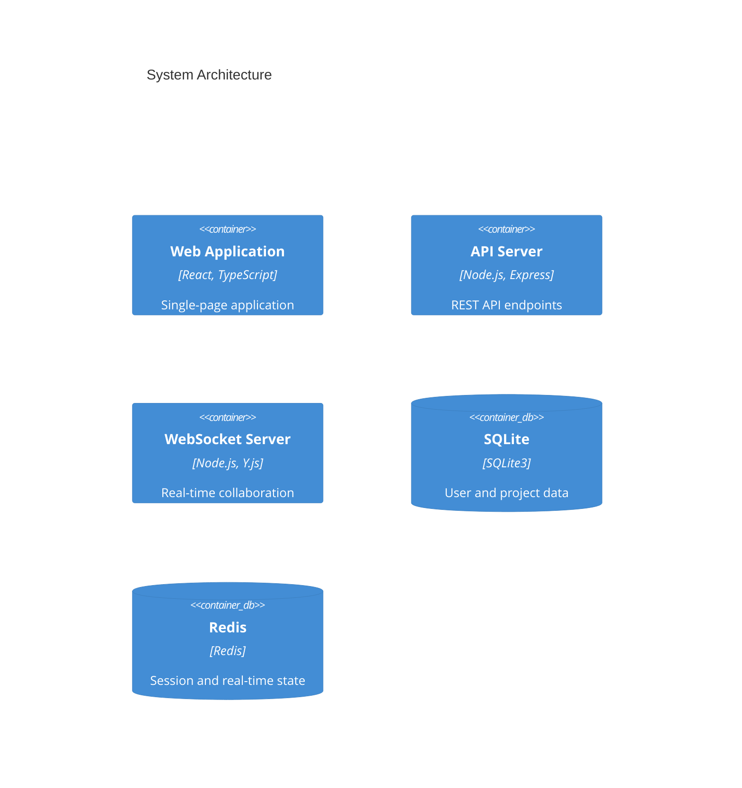

# Collaborative ERD Visualization Tool

[](https://github.com/yourusername/erd-tool/actions)
[](https://github.com/yourusername/erd-tool/releases)
[](https://codecov.io/gh/yourusername/erd-tool)
[](LICENSE)
[](https://nodejs.org)
[](https://www.typescriptlang.org)

A real-time collaborative Entity Relationship Diagram (ERD) visualization tool that enables database architects and development teams to design, visualize, and document database schemas together. The platform automatically generates interactive ERDs from SQL DDL statements and supports simultaneous multi-user editing with enterprise-grade features.

## 🚀 Key Features

- Real-time multi-user collaboration powered by Y.js CRDT synchronization
- Automated ERD generation from SQL DDL statements with multi-dialect support
- Interactive diagram editing using React Flow with custom nodes and edges
- Real-time presence indicators and cursor tracking
- Version control with bidirectional history navigation
- Project and workspace organization with role-based access
- Dark/light theme support with system preference detection
- Integrated chat and annotation system
- Export capabilities (PNG, SQL, Documentation)

## 🏗️ Architecture



## 📋 Prerequisites

- Node.js 18 LTS
- pnpm 8.x
- Redis 7.x
- SQLite 3.x
- Modern web browser (Chrome 90+, Firefox 88+, Safari 14+, Edge 90+)

## 🚦 Quick Start

1. Clone the repository:
```bash
git clone https://github.com/yourusername/erd-tool.git
cd erd-tool
```

2. Install dependencies:
```bash
pnpm install
```

3. Configure environment:
```bash
cp .env.example .env
# Edit .env with your configuration
```

4. Start development servers:
```bash
pnpm dev
```

5. Access the application at http://localhost:3000

## 💻 Development

Refer to detailed documentation:
- [Frontend Documentation](src/web/README.md)
- [Backend Documentation](src/backend/README.md)
- [Contributing Guidelines](CONTRIBUTING.md)

### Code Quality

- TypeScript for type safety
- ESLint and Prettier for code style
- Vitest for unit testing
- Playwright for E2E testing
- Minimum 80% test coverage required

### Git Workflow

1. Create feature branch: `feature/description`
2. Commit using conventional commits
3. Submit PR with description and tests
4. Pass CI checks and code review
5. Squash and merge to main

## 🚀 Deployment

### Docker Deployment

```bash
# Build images
docker compose build

# Start services
docker compose up -d
```

### Environment Configuration

Required environment variables:
```
NODE_ENV=production
API_URL=https://api.yourdomain.com
WS_URL=wss://ws.yourdomain.com
REDIS_URL=redis://redis:6379
DATABASE_URL=file:/data/sqlite.db
```

### Infrastructure Requirements

- CPU: 8 vCPUs minimum
- RAM: 16GB minimum
- Storage: 250GB SSD
- Network: 100Mbps minimum

## 🔒 Security

- Authentication via Auth.js
- Role-based access control
- AES-256-GCM encryption at rest
- HTTPS/WSS with TLS 1.3
- Regular security audits
- GDPR compliance measures

## 📈 Performance

- Initial load time: < 3 seconds
- Diagram scale: 100+ tables
- Real-time sync latency: < 100ms
- Concurrent users: 25 per workspace
- Browser support: Latest 2 versions

## 🤝 Contributing

Please read our [Contributing Guidelines](CONTRIBUTING.md) before submitting pull requests.

## 🆘 Support

- [Issue Tracker](https://github.com/yourusername/erd-tool/issues)
- [Security Policy](SECURITY.md)
- [Community Discussions](https://github.com/yourusername/erd-tool/discussions)

## 📄 License

This project is licensed under the MIT License - see the [LICENSE](LICENSE) file for details.