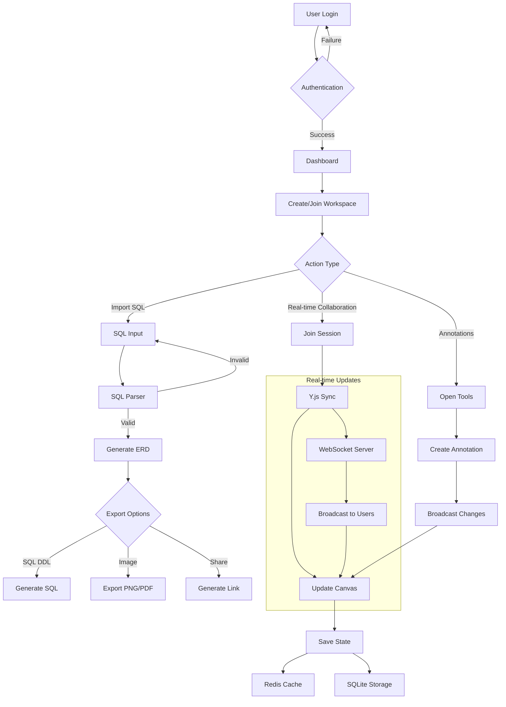
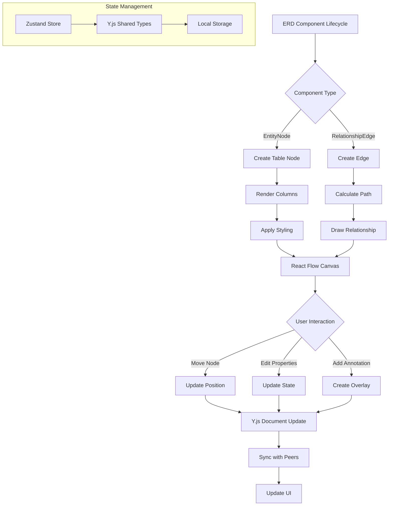
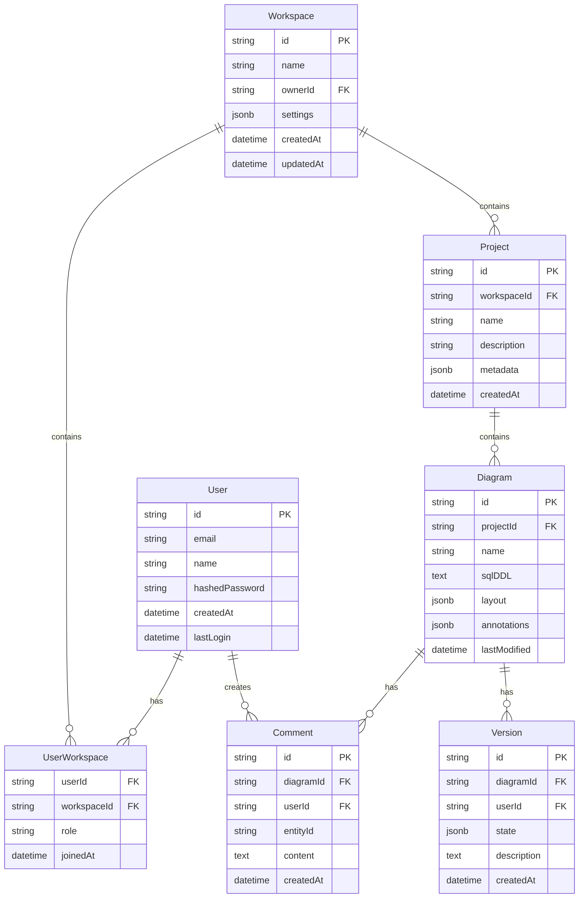
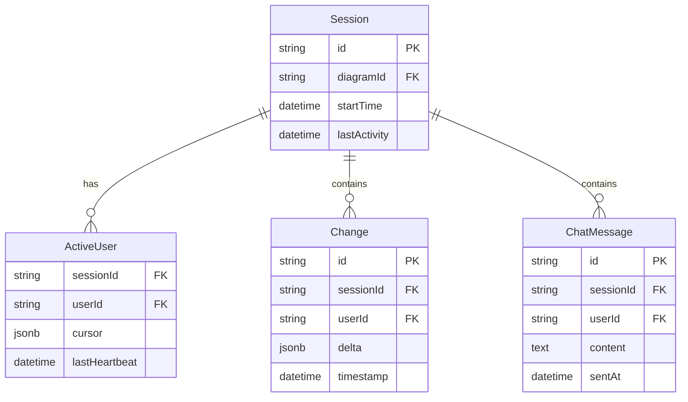
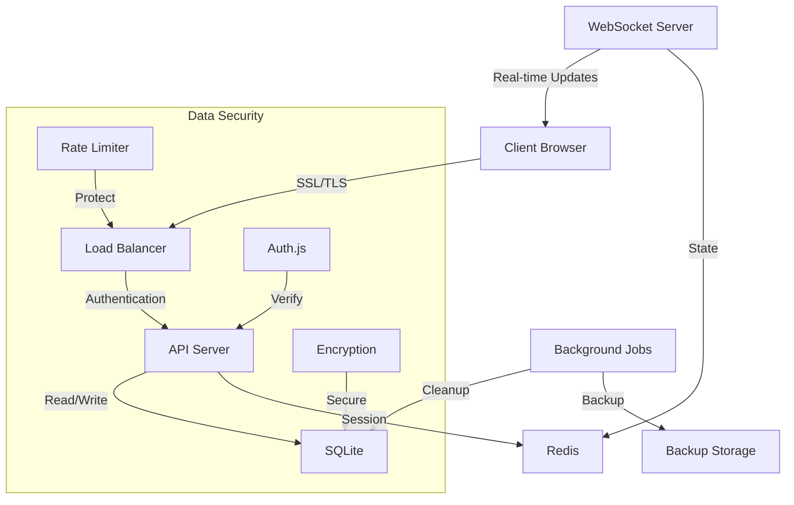
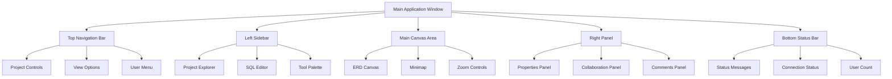

# Product Requirements Document (PRD)

# 1. INTRODUCTION

## 1.1 Purpose

This Software Requirements Specification (SRS) document provides a comprehensive description of the Collaborative ERD Visualization Tool. It details the functional and non-functional requirements for developers, stakeholders, and project managers involved in the development process. The document serves as the primary reference for technical implementation and validation of the delivered system.

## 1.2 Scope

The Collaborative ERD Visualization Tool is a web-based application that enables real-time collaboration on database schema design through Entity Relationship Diagrams. The system will:

- Process SQL DDL statements to automatically generate visual ERDs
- Enable multiple users to simultaneously view and edit diagrams
- Provide annotation and communication tools for effective collaboration
- Support multiple SQL dialects including Snowflake and PostgreSQL
- Offer project management capabilities for organizing and sharing diagrams
- Export diagrams and schemas in various formats

Key benefits include:
- Improved database design collaboration efficiency
- Reduced miscommunication in database architecture discussions
- Streamlined documentation of database schemas
- Enhanced visibility of database structure changes
- Simplified sharing of database designs across teams

The system will be built using:
- React 18+ with TypeScript for the frontend
- Node.js with Express for the backend
- Y.js for real-time collaboration
- React Flow for diagram rendering
- SQLite for user data storage
- Redis for session management

# 2. PRODUCT DESCRIPTION

## 2.1 Product Perspective
The Collaborative ERD Visualization Tool operates as a standalone web application while integrating with existing database systems. It fits into the broader ecosystem of database design and documentation tools by:

- Serving as a bridge between SQL DDL and visual database schema representation
- Complementing existing database management tools through schema import/export capabilities
- Operating independently of but compatible with major SQL database platforms
- Functioning within standard web browsers without additional software installation
- Integrating with existing authentication systems through Auth.js

## 2.2 Product Functions
The system provides these core functions:

1. SQL Processing and Visualization
   - Automatic ERD generation from SQL DDL statements
   - Real-time visual updates as SQL changes
   - Support for multiple SQL dialects
   - Validation and error highlighting

2. Collaborative Features
   - Synchronized multi-user diagram viewing and editing
   - Real-time cursor and user presence tracking
   - In-context chat and commenting
   - Change history with undo/redo capabilities

3. Diagram Management
   - Project workspace organization
   - Version control of diagrams
   - Export functionality (PNG, PDF, SQL)
   - Custom styling and layout options

4. Annotation and Documentation
   - Sticky notes and drawing tools
   - Comment threads on specific entities
   - Custom labels and tagging
   - Documentation generation

## 2.3 User Characteristics

| User Type | Technical Expertise | Primary Use Cases | Expected Frequency |
|-----------|-------------------|-------------------|-------------------|
| Database Architects | Expert | Schema design, documentation, team collaboration | Daily |
| Data Engineers | High | Schema implementation, optimization, version tracking | Weekly |
| Software Developers | Moderate to High | Schema understanding, implementation reference | Weekly |
| Data Analysts | Moderate | Schema exploration, documentation reference | Monthly |
| Technical PMs | Low to Moderate | Project planning, requirement documentation | Monthly |
| Database Administrators | Expert | Schema maintenance, change management | Weekly |

## 2.4 Constraints

1. Technical Constraints
   - Browser compatibility limited to latest two versions of major browsers
   - Maximum 100 tables per diagram for performance
   - 25 concurrent users per workspace limit
   - WebSocket connection required for real-time features
   - Local storage limitations based on browser

2. Business Constraints
   - Initial release limited to Snowflake and PostgreSQL support
   - Single server deployment model
   - Self-hosted deployment requirement
   - No offline functionality

3. Regulatory Constraints
   - GDPR compliance for user data storage
   - Data residency requirements for EU customers
   - Security requirements for database credentials

## 2.5 Assumptions and Dependencies

### Assumptions
1. Users have stable internet connections with minimum 1Mbps bandwidth
2. Users are familiar with basic database concepts and SQL
3. Modern web browsers are used (Chrome, Firefox, Safari, Edge)
4. Server environment supports Node.js and Redis
5. Users accept browser-based storage of workspace data

### Dependencies
1. External Services
   - Auth.js for authentication
   - Redis for session management
   - SQLite for persistent storage

2. Third-party Libraries
   - React Flow for diagram rendering
   - Y.js for collaboration
   - sqlite-parser for SQL parsing
   - shadcn/ui for UI components

3. Infrastructure
   - WebSocket server availability
   - Node.js runtime environment
   - Database system accessibility for schema import/export

# 3. PROCESS FLOWCHART





# 4. FUNCTIONAL REQUIREMENTS

## 4.1 SQL Processing Engine (FE-001)

### Description
Core functionality to parse, validate, and process SQL DDL statements into visual representations.

### Priority
Critical (P0)

### Requirements

| ID | Requirement | Acceptance Criteria |
|---|-------------|-------------------|
| FE-001.1 | Parse SQL DDL statements | - Support CREATE TABLE statements<br>- Handle column definitions<br>- Process constraints and keys |
| FE-001.2 | Multi-dialect support | - Parse PostgreSQL syntax<br>- Parse Snowflake syntax<br>- Detect dialect automatically |
| FE-001.3 | Validation | - Highlight syntax errors<br>- Show error messages<br>- Suggest corrections |
| FE-001.4 | Incremental processing | - Process schema changes<br>- Update existing diagrams<br>- Maintain diagram state |

## 4.2 ERD Visualization (FE-002)

### Description
Visual representation system for database schemas using interactive diagrams.

### Priority
Critical (P0)

### Requirements

| ID | Requirement | Acceptance Criteria |
|---|-------------|-------------------|
| FE-002.1 | Entity rendering | - Display table names<br>- Show column details<br>- Indicate key types |
| FE-002.2 | Relationship rendering | - Show connections between tables<br>- Display cardinality<br>- Auto-route edges |
| FE-002.3 | Layout management | - Auto-arrange entities<br>- Support manual positioning<br>- Implement snap-to-grid |
| FE-002.4 | Interactive controls | - Zoom 0.1x to 4x<br>- Pan canvas<br>- Select elements |

## 4.3 Real-time Collaboration (FE-003)

### Description
Multi-user synchronization and interaction capabilities.

### Priority
High (P1)

### Requirements

| ID | Requirement | Acceptance Criteria |
|---|-------------|-------------------|
| FE-003.1 | State synchronization | - Sync diagram changes<br>- Handle concurrent edits<br>- Resolve conflicts |
| FE-003.2 | User presence | - Show active users<br>- Display cursor positions<br>- Indicate user actions |
| FE-003.3 | Change tracking | - Record modifications<br>- Support undo/redo<br>- Show change history |
| FE-003.4 | Permissions | - Role-based access<br>- Edit restrictions<br>- View-only mode |

## 4.4 Annotation System (FE-004)

### Description
Tools for adding explanatory notes and markups to diagrams.

### Priority
Medium (P2)

### Requirements

| ID | Requirement | Acceptance Criteria |
|---|-------------|-------------------|
| FE-004.1 | Note creation | - Add sticky notes<br>- Support formatting<br>- Allow repositioning |
| FE-004.2 | Drawing tools | - Create shapes<br>- Draw arrows<br>- Set colors |
| FE-004.3 | Comments | - Thread-based discussions<br>- Entity-specific comments<br>- Notification system |
| FE-004.4 | Labels | - Custom tagging<br>- Color coding<br>- Search/filter by labels |

## 4.5 Project Management (FE-005)

### Description
Organization and administration of diagram projects and workspaces.

### Priority
High (P1)

### Requirements

| ID | Requirement | Acceptance Criteria |
|---|-------------|-------------------|
| FE-005.1 | Workspace management | - Create projects<br>- Organize diagrams<br>- Set permissions |
| FE-005.2 | Version control | - Save versions<br>- Compare changes<br>- Restore previous states |
| FE-005.3 | Export options | - Generate PNG/PDF<br>- Export SQL DDL<br>- Share links |
| FE-005.4 | Templates | - Save as template<br>- Apply templates<br>- Manage template library |

# 5. NON-FUNCTIONAL REQUIREMENTS

## 5.1 Performance Requirements

| Metric | Requirement | Measurement |
|--------|-------------|-------------|
| Page Load Time | < 3 seconds initial load | Chrome Lighthouse Performance Score > 90 |
| API Response Time | < 200ms for 95% of requests | Server-side monitoring |
| Real-time Sync Latency | < 100ms for updates | Client-side measurement |
| Memory Usage | < 512MB RAM per client session | Browser Performance API |
| WebSocket Connection | < 50ms connection establishment | Network panel metrics |
| SQL Processing | < 1 second for 100 table schema | Processing time logs |
| Canvas Rendering | 60 FPS during interactions | React DevTools profiler |
| Database Queries | < 100ms for CRUD operations | Query execution time |

## 5.2 Safety Requirements

| Category | Requirement | Implementation |
|----------|-------------|----------------|
| Data Loss Prevention | Automatic saves every 30 seconds | Y.js persistence layer |
| Error Recovery | Session state recovery after disconnection | WebSocket reconnection strategy |
| Backup System | Daily backups of all project data | Automated SQLite backups |
| Version Control | 30-day version history retention | State delta storage |
| Conflict Resolution | Automatic merge of concurrent changes | Y.js CRDT implementation |
| Failure Isolation | Component-level error boundaries | React Error Boundary components |
| Data Validation | Schema validation before processing | JSON Schema validation |

## 5.3 Security Requirements

| Feature | Requirement | Standard |
|---------|-------------|-----------|
| Authentication | Multi-factor authentication support | Auth.js implementation |
| Authorization | Role-based access control (RBAC) | Custom RBAC middleware |
| Data Encryption | TLS 1.3 for all connections | SSL/TLS certificates |
| Data at Rest | AES-256 encryption for stored data | Node.js crypto module |
| Session Management | JWT with 24-hour expiration | Redis session store |
| API Security | Rate limiting and request validation | Express middleware |
| SQL Injection Prevention | Parameterized queries only | Query sanitization |
| Cross-Site Scripting | Content Security Policy implementation | CSP headers |

## 5.4 Quality Requirements

### 5.4.1 Availability
- 99.9% uptime during business hours
- Maximum planned downtime of 4 hours/month
- Automated health checks every 5 minutes
- Redundant WebSocket servers

### 5.4.2 Maintainability
- Code coverage > 80%
- Documentation for all APIs
- Automated deployment pipeline
- Modular architecture with clear separation of concerns

### 5.4.3 Usability
- WCAG 2.1 Level AA compliance
- Support for keyboard navigation
- Interface response time < 100ms
- Consistent design system implementation

### 5.4.4 Scalability
- Support for 1000 concurrent users
- Horizontal scaling of WebSocket servers
- Database sharding capability
- CDN integration for static assets

### 5.4.5 Reliability
- Recovery Point Objective (RPO) of 5 minutes
- Recovery Time Objective (RTO) of 30 minutes
- Automated failover for critical services
- Error rate < 0.1% for all operations

## 5.5 Compliance Requirements

| Requirement | Standard | Implementation |
|-------------|----------|----------------|
| Data Privacy | GDPR compliance | Data processing agreements |
| Data Residency | EU data center option | Regional deployment options |
| Accessibility | WCAG 2.1 Level AA | Automated accessibility testing |
| Security Standards | SOC 2 Type II | Annual audit compliance |
| Browser Support | Latest 2 versions of major browsers | Cross-browser testing suite |
| Code Standards | TypeScript strict mode | ESLint configuration |
| API Documentation | OpenAPI 3.0 specification | Swagger documentation |
| Package Licensing | MIT/Apache 2.0 compatible | License compliance checking |

# 6. DATA REQUIREMENTS

## 6.1 Data Models

### 6.1.1 Core Data Entities



### 6.1.2 Real-time Collaboration Data



## 6.2 Data Storage

### 6.2.1 Primary Storage
- SQLite database for persistent storage
- Tables normalized according to data models above
- Indexes on frequently queried fields
- JSON columns for flexible schema elements

### 6.2.2 Cache Layer
- Redis for session management and real-time data
- 24-hour TTL for session data
- LRU cache policy for diagram states
- Persistent Redis for critical data

### 6.2.3 Data Retention
- Active workspace data: Indefinite
- Version history: 30 days
- Session data: 24 hours
- Chat history: 7 days
- User activity logs: 90 days

### 6.2.4 Backup Strategy
- Full database backup: Daily
- Incremental backups: Every 6 hours
- Transaction logs: Real-time
- Backup retention: 30 days
- Geographic redundancy: 2 locations

### 6.2.5 Recovery Procedures
- Point-in-time recovery capability
- Automated recovery testing weekly
- Recovery time objective (RTO): 30 minutes
- Recovery point objective (RPO): 5 minutes

## 6.3 Data Processing

### 6.3.1 Data Flow



### 6.3.2 Data Security

| Layer | Security Measure | Implementation |
|-------|-----------------|----------------|
| Transport | TLS 1.3 | SSL certificates |
| Storage | AES-256 | Node.js crypto |
| API | JWT tokens | Auth.js |
| Database | Row-level security | SQLite permissions |
| Cache | Encrypted Redis | Redis ACLs |
| Backup | Encrypted storage | Cloud provider encryption |

### 6.3.3 Data Validation
- JSON Schema validation for API payloads
- SQL DDL parsing validation
- Type checking with TypeScript
- Input sanitization for XSS prevention
- Schema validation before storage

### 6.3.4 Data Transformation
- SQL DDL to ERD conversion
- Layout calculation and optimization
- State delta computation
- Export format conversion
- Version diff generation

# 7. EXTERNAL INTERFACES

## 7.1 User Interfaces

### 7.1.1 General Requirements
- Responsive design for desktop browsers (1024px - 4K)
- Dark and light theme support using Tailwind CSS
- WCAG 2.1 Level AA compliance
- Keyboard navigation support
- Consistent shadcn/ui component usage

### 7.1.2 Layout Structure



### 7.1.3 Component Specifications

| Component | Requirements |
|-----------|--------------|
| SQL Editor | - Monaco Editor integration<br>- Syntax highlighting<br>- Error indicators<br>- Auto-completion |
| ERD Canvas | - React Flow canvas<br>- Custom node components<br>- Edge routing<br>- Selection controls |
| Properties Panel | - Form controls<br>- Validation feedback<br>- Real-time updates |
| Collaboration Panel | - User avatars<br>- Chat interface<br>- Presence indicators |

## 7.2 Software Interfaces

### 7.2.1 Database Interfaces

| Interface | Specification |
|-----------|--------------|
| SQLite | - Node.js sqlite3 driver<br>- Connection pooling<br>- Prepared statements |
| Redis | - ioredis client<br>- Pub/sub channels<br>- Cache operations |
| External DBs | - Database-specific drivers<br>- Connection string support<br>- SSL/TLS encryption |

### 7.2.2 Authentication Interface

```json
{
  "provider": "Auth.js",
  "methods": ["email", "oauth"],
  "endpoints": {
    "signin": "/api/auth/signin",
    "signout": "/api/auth/signout",
    "session": "/api/auth/session"
  },
  "callbacks": {
    "authorized": "Required",
    "signIn": "Optional",
    "redirect": "Optional"
  }
}
```

### 7.2.3 WebSocket Interface

```typescript
interface WebSocketMessage {
  type: 'sync' | 'presence' | 'chat' | 'cursor';
  payload: {
    userId: string;
    workspaceId: string;
    data: any;
    timestamp: number;
  };
  metadata?: {
    version: string;
    compression?: boolean;
  };
}
```

## 7.3 Communication Interfaces

### 7.3.1 Network Protocols

| Protocol | Usage | Specification |
|----------|--------|---------------|
| HTTPS | REST API | TLS 1.3, JSON payloads |
| WSS | Real-time sync | Binary protocol, Y.js messages |
| HTTP/2 | Static assets | Push-enabled, multiplexed |

### 7.3.2 API Formats

```json
{
  "openapi": "3.0.0",
  "paths": {
    "/api/v1/*": {
      "format": "JSON",
      "authentication": "JWT",
      "rateLimit": "100/minute"
    },
    "/ws/*": {
      "format": "Binary",
      "protocol": "WebSocket",
      "compression": "enabled"
    }
  }
}
```

### 7.3.3 Integration Points

| Service | Protocol | Format | Security |
|---------|----------|---------|-----------|
| Auth Provider | HTTPS | OAuth 2.0 | TLS 1.3 |
| Database Export | TCP | Native Protocol | SSL/TLS |
| File Storage | HTTPS | Multipart | Signed URLs |
| Metrics Export | HTTP | Prometheus | Basic Auth |

# 8. APPENDICES

## 8.1 GLOSSARY

| Term | Definition |
|------|------------|
| CRDT | Conflict-free Replicated Data Type - Data structure used by Y.js for real-time collaboration |
| DDL | Data Definition Language - SQL statements used to define database schemas |
| ERD | Entity Relationship Diagram - Visual representation of database tables and their relationships |
| WebSocket | Communication protocol providing full-duplex communication channels over TCP |
| Y.js | Framework for building collaborative applications with real-time synchronization |
| React Flow | Library for building node-based interactive diagrams |
| Operational Transform | Algorithm for maintaining consistency in collaborative editing |
| Cardinality | The numerical relationship between entities in a database relationship |

## 8.2 ACRONYMS

| Acronym | Expansion |
|---------|-----------|
| API | Application Programming Interface |
| CRUD | Create, Read, Update, Delete |
| CSP | Content Security Policy |
| GDPR | General Data Protection Regulation |
| JWT | JSON Web Token |
| LRU | Least Recently Used |
| RBAC | Role-Based Access Control |
| RPO | Recovery Point Objective |
| RTO | Recovery Time Objective |
| SSL | Secure Sockets Layer |
| TLS | Transport Layer Security |
| TTL | Time To Live |
| WCAG | Web Content Accessibility Guidelines |
| WSS | WebSocket Secure |
| XSS | Cross-Site Scripting |

## 8.3 ADDITIONAL REFERENCES

### Technical Documentation
- [React Flow Documentation](https://reactflow.dev/docs/introduction/)
- [Y.js Documentation](https://docs.yjs.dev/)
- [Auth.js Guide](https://authjs.dev/getting-started/introduction)
- [SQLite Documentation](https://sqlite.org/docs.html)
- [Redis Documentation](https://redis.io/documentation)

### Standards and Specifications
- [OpenAPI 3.0 Specification](https://swagger.io/specification/)
- [WebSocket Protocol RFC 6455](https://datatracker.ietf.org/doc/html/rfc6455)
- [JSON Schema](https://json-schema.org/specification.html)
- [WCAG 2.1 Guidelines](https://www.w3.org/WAI/WCAG21/quickref/)

### Development Resources
- [TypeScript Handbook](https://www.typescriptlang.org/docs/)
- [Tailwind CSS Documentation](https://tailwindcss.com/docs)
- [shadcn/ui Components](https://ui.shadcn.com/)
- [Node.js Best Practices](https://github.com/goldbergyoni/nodebestpractices)

### Security Guidelines
- [OWASP Web Security Testing Guide](https://owasp.org/www-project-web-security-testing-guide/)
- [GDPR Compliance Checklist](https://gdpr.eu/checklist/)
- [SOC 2 Compliance Requirements](https://www.aicpa.org/soc2)