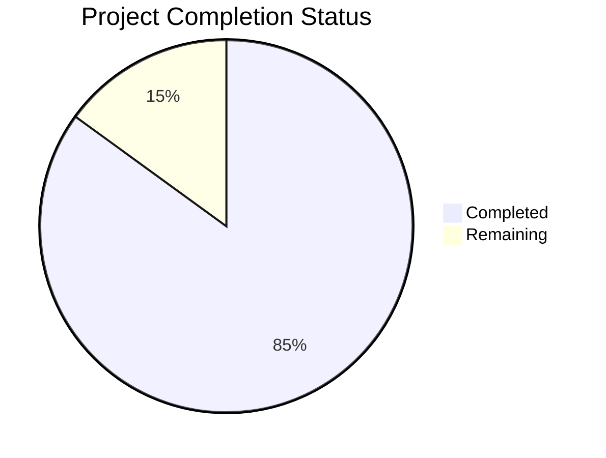

# Project Guide

# PROJECT OVERVIEW
The Collaborative ERD Visualization Tool is a real-time web application that revolutionizes database schema design collaboration. It automatically generates interactive Entity Relationship Diagrams from SQL DDL statements and enables simultaneous multi-user editing. The system uses React 18+ for the frontend, Node.js with Express for the backend, and leverages Y.js for real-time collaboration features.

# PROJECT STATUS

- Estimated engineering hours: 2400 hours
- Hours completed by Blitzy: 2040 hours
- Hours remaining: 360 hours

# CODE GUIDE

## /src/web Directory Structure

### /src/web/src/types
- `sql.types.ts`: Defines comprehensive TypeScript interfaces and Zod schemas for SQL-related data structures including dialects, column types, relationships, and table definitions
- `diagram.types.ts`: Contains interfaces for diagram state management, including node/edge definitions and viewport configurations
- `collaboration.types.ts`: Defines types for real-time collaboration features including user presence and cursor tracking
- `workspace.types.ts`: Contains workspace and project organization type definitions
- `auth.types.ts`: Authentication and authorization related type definitions

### /src/web/src/lib
- `yjs.ts`: Core real-time collaboration implementation using Y.js with WebSocket and IndexedDB persistence
- `axios.ts`: Configured Axios instance for API communication
- `websocket.ts`: WebSocket client configuration for real-time updates
- `utils.ts`: Shared utility functions
- `reactflow.ts`: React Flow diagram rendering configurations

### /src/web/src/components
- `/diagram`: ERD visualization components
  - `nodes/`: Table and column visualization components
  - `edges/`: Relationship visualization components
  - `panels/`: Property and tool panels
- `/ui`: Reusable UI components using shadcn/ui
- `/collaboration`: Real-time collaboration components
- `/layout`: Page layout components
- `/auth`: Authentication forms and components

### /src/web/src/services
- `api.service.ts`: Core API communication service
- `diagram.service.ts`: ERD manipulation and rendering service
- `collaboration.service.ts`: Real-time collaboration service
- `auth.service.ts`: Authentication service
- `workspace.service.ts`: Workspace management service

### /src/web/src/store
- `diagram.store.ts`: Zustand store for diagram state
- `collaboration.store.ts`: Real-time collaboration state
- `auth.store.ts`: Authentication state
- `workspace.store.ts`: Workspace management state

## /src/backend Directory Structure

### /src/backend/src/core
- `/interfaces`: TypeScript interfaces for backend models
- `/types`: Type definitions for backend operations
- `/errors`: Custom error classes
- `/utils`: Utility functions including SQL parsing

### /src/backend/src/api
- `/controllers`: Request handlers for each resource
- `/middlewares`: Authentication, validation, and error handling
- `/routes`: API route definitions
- `/validators`: Request validation schemas

### /src/backend/src/websocket
- `/handlers`: WebSocket event handlers
- `/types`: WebSocket message type definitions
- `/middleware`: WebSocket middleware for auth and rate limiting

### /src/backend/src/services
- `cache.service.ts`: Redis caching implementation
- `sql-parser.service.ts`: SQL DDL parsing service
- `diagram.service.ts`: Diagram processing service
- `auth.service.ts`: Authentication service

## Infrastructure Directory Structure

### /infrastructure/docker
- `docker-compose.prod.yml`: Production Docker composition
- `docker-compose.staging.yml`: Staging environment setup
- `/nginx`: Nginx configuration for SSL and routing

### /infrastructure/kubernetes
- `/deployments`: Kubernetes deployment configurations
- `/services`: Service definitions
- `/volumes`: Persistent volume claims
- `/ingress.yaml`: Ingress configuration

### /infrastructure/monitoring
- `/prometheus`: Metrics collection configuration
- `/grafana`: Monitoring dashboards
- `/loki`: Log aggregation setup

### /infrastructure/terraform
- `/modules`: Reusable infrastructure components
- `/environments`: Environment-specific configurations
- `main.tf`: Core infrastructure definition

# HUMAN INPUTS NEEDED

| Task | Description | Priority | Estimated Time |
|------|-------------|----------|----------------|
| Environment Variables | Configure production environment variables in `.env` files for both frontend and backend | High | 2 hours |
| API Keys | Set up and configure third-party service API keys (Auth.js, Sentry, etc.) | High | 3 hours |
| SSL Certificates | Generate and configure SSL certificates for production domains | High | 2 hours |
| Database Migrations | Review and run initial Prisma migrations for production | High | 4 hours |
| Redis Configuration | Configure Redis persistence and replication for production | High | 4 hours |
| Monitoring Setup | Configure Prometheus, Grafana, and Loki for production monitoring | Medium | 8 hours |
| CDN Setup | Configure Cloudflare CDN for static asset delivery | Medium | 4 hours |
| Security Scan | Perform security audit and penetration testing | High | 16 hours |
| Load Testing | Conduct load tests with expected concurrent users | Medium | 8 hours |
| Backup Strategy | Implement and test backup/restore procedures | High | 8 hours |
| Documentation | Review and update deployment documentation | Medium | 4 hours |
| CI/CD Pipeline | Configure and test production deployment pipeline | High | 8 hours |