# Technical Specifications

# 1. INTRODUCTION

## 1.1 EXECUTIVE SUMMARY

The Collaborative ERD Visualization Tool is a real-time web application designed to revolutionize how database architects and development teams collaborate on database schema design. By automatically generating interactive Entity Relationship Diagrams from SQL DDL statements and enabling simultaneous multi-user editing, the system addresses the critical challenge of distributed database design collaboration.

The platform serves database architects, engineers, developers, and technical stakeholders who need to visualize, discuss, and document database schemas effectively. By providing real-time visualization, annotation capabilities, and integrated communication tools, the system aims to reduce design iteration cycles by 50% and improve schema documentation accuracy by 75%.

## 1.2 SYSTEM OVERVIEW

### Project Context

| Aspect | Description |
| --- | --- |
| Market Position | First-to-market collaborative ERD tool with real-time capabilities |
| Current Limitations | Existing tools lack real-time collaboration and automated visualization |
| Enterprise Integration | Standalone system with database platform connectors |

### High-Level Description

The system architecture employs:

- React 18+ frontend with TypeScript for type safety
- Node.js backend with Express for API services
- Y.js for conflict-free real-time collaboration
- React Flow for interactive diagram rendering
- SQLite for user data persistence
- Redis for session management and real-time state

### Success Criteria

| Metric | Target |
| --- | --- |
| Initial Load Time | \< 3 seconds |
| Concurrent Users | 25 per workspace |
| Diagram Scale | Support for 100 tables |
| Sync Latency | \< 100ms for updates |
| User Adoption | 80% team participation |

## 1.3 SCOPE

### In-Scope Elements

#### Core Features

| Feature Category | Components |
| --- | --- |
| SQL Processing | - DDL parsing and validation<br>- Multiple SQL dialect support<br>- Auto-formatting |
| Visualization | - Automatic ERD generation<br>- Interactive canvas<br>- Relationship mapping |
| Collaboration | - Real-time multi-user editing<br>- Presence indicators<br>- Change tracking |
| Project Management | - Workspace organization<br>- Version control<br>- Export capabilities |

#### Implementation Boundaries

| Boundary Type | Coverage |
| --- | --- |
| User Groups | Database architects, engineers, developers, analysts |
| Supported Databases | Snowflake, PostgreSQL |
| Deployment | Single-server, self-hosted |
| Data Scope | Database schema metadata |

### Out-of-Scope Elements

- Offline functionality
- Mobile device optimization
- Data modeling beyond ERD visualization
- Database query execution
- Schema migration tools
- Custom database connectors
- Third-party tool integrations
- Automated documentation generation
- AI-powered suggestions
- Custom visualization templates

# 2. SYSTEM ARCHITECTURE

## 2.1 High-Level Architecture

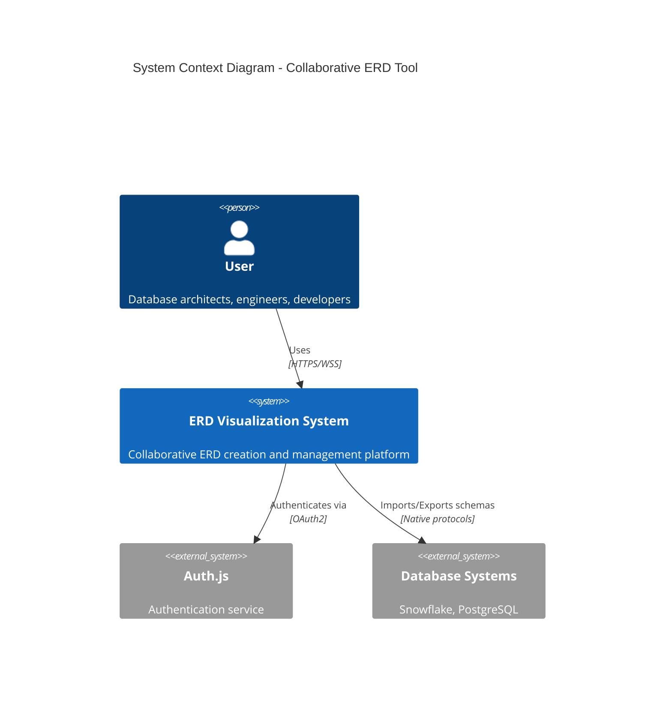

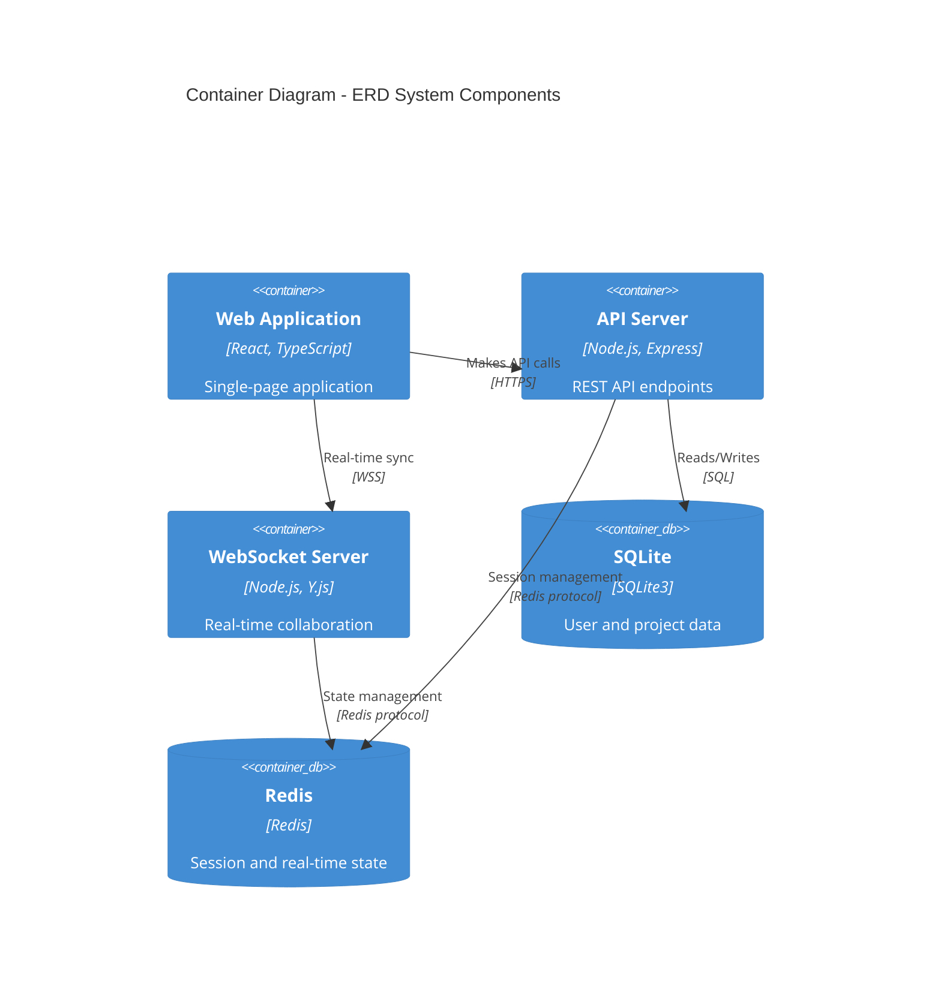

## 2.2 Component Details

### 2.2.1 Frontend Components

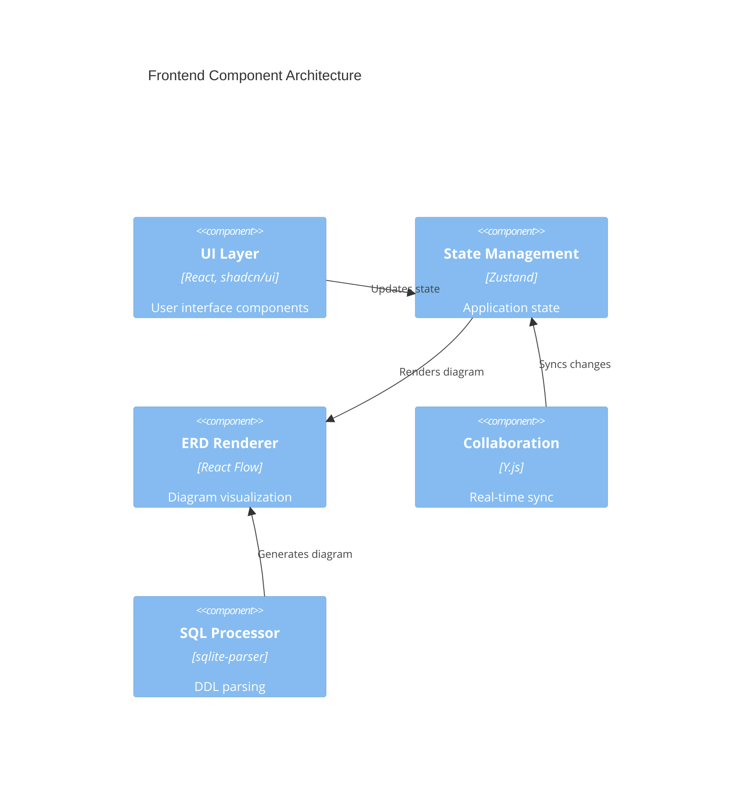

### 2.2.2 Backend Components

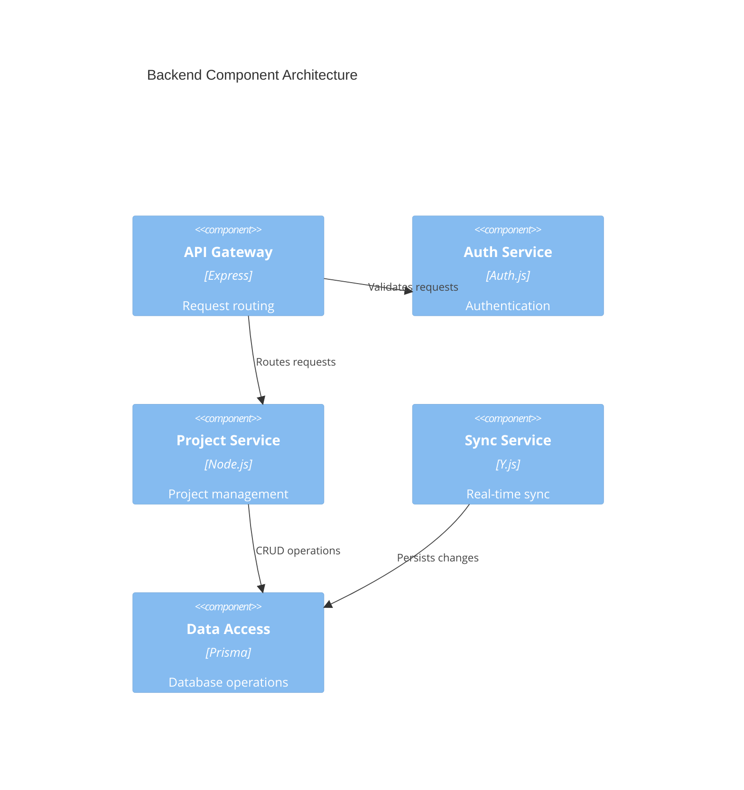

## 2.3 Technical Decisions

| Component | Decision | Rationale |
| --- | --- | --- |
| Architecture Style | Monolithic with service separation | Simplifies deployment, suitable for initial scale |
| State Management | Zustand + Y.js | Lightweight, excellent CRDT support |
| Database | SQLite | Easy deployment, sufficient for MVP scale |
| Caching | Redis | Fast in-memory operations, pub/sub support |
| API Design | REST + WebSocket | Standard HTTP for CRUD, WebSocket for real-time |

## 2.4 Cross-Cutting Concerns

### 2.4.1 Monitoring Architecture

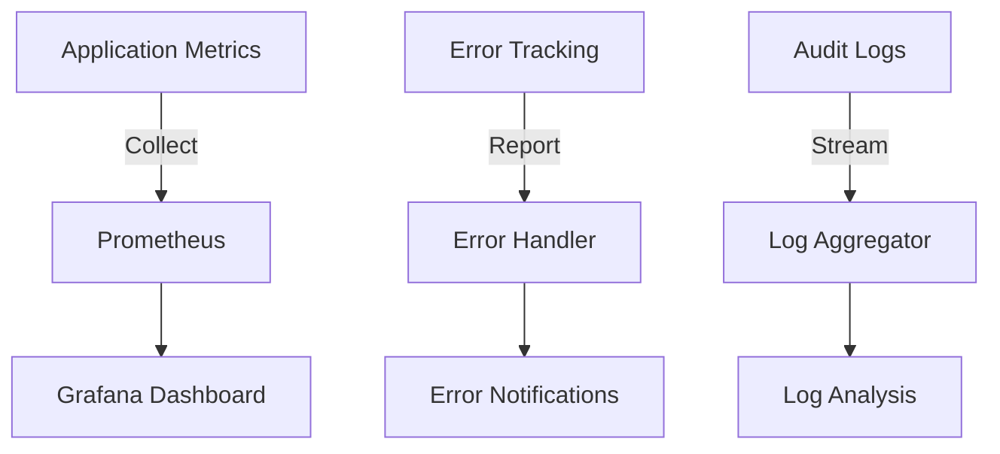

### 2.4.2 Security Architecture

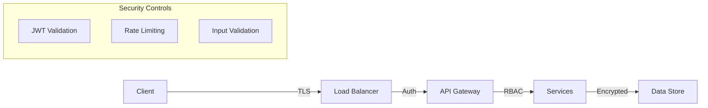

## 2.5 Deployment Architecture

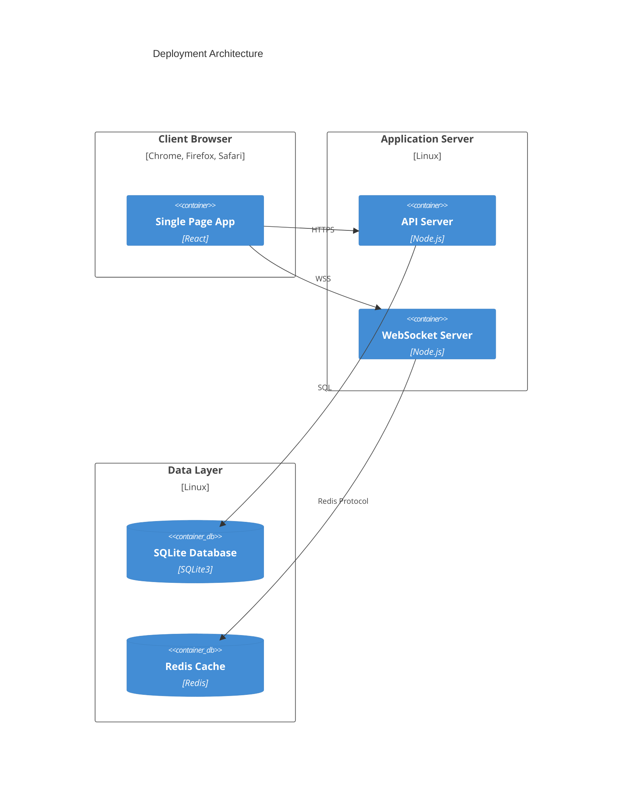

# 3. SYSTEM COMPONENTS ARCHITECTURE

## 3.1 USER INTERFACE DESIGN

### 3.1.1 Design Specifications

| Category | Requirements |
| --- | --- |
| Visual Hierarchy | - Z-index layers: overlay (400), modal (300), dropdown (200), base (100)<br>- Consistent spacing scale: 4px, 8px, 16px, 24px, 32px, 48px<br>- Typography scale: 12px, 14px, 16px, 20px, 24px, 32px |
| Component Library | shadcn/ui components with custom theming:<br>- Primary actions: filled buttons<br>- Secondary actions: outlined buttons<br>- Tertiary actions: text buttons<br>- Form controls: floating labels |
| Responsive Design | - Breakpoints: sm (640px), md (768px), lg (1024px), xl (1280px)<br>- Mobile-first approach<br>- Fluid typography scaling<br>- Collapsible panels on smaller screens |
| Accessibility | - WCAG 2.1 Level AA compliance<br>- ARIA landmarks and labels<br>- Keyboard navigation support<br>- Focus management<br>- Screen reader optimization |
| Browser Support | Latest 2 versions of:<br>- Chrome<br>- Firefox<br>- Safari<br>- Edge |
| Theme Support | - System preference detection<br>- Manual theme toggle<br>- Persistent theme selection<br>- Custom theme variables |
| i18n Support | - RTL layout support<br>- Unicode handling<br>- Date/time formatting<br>- Number formatting |

### 3.1.2 Interface Layout

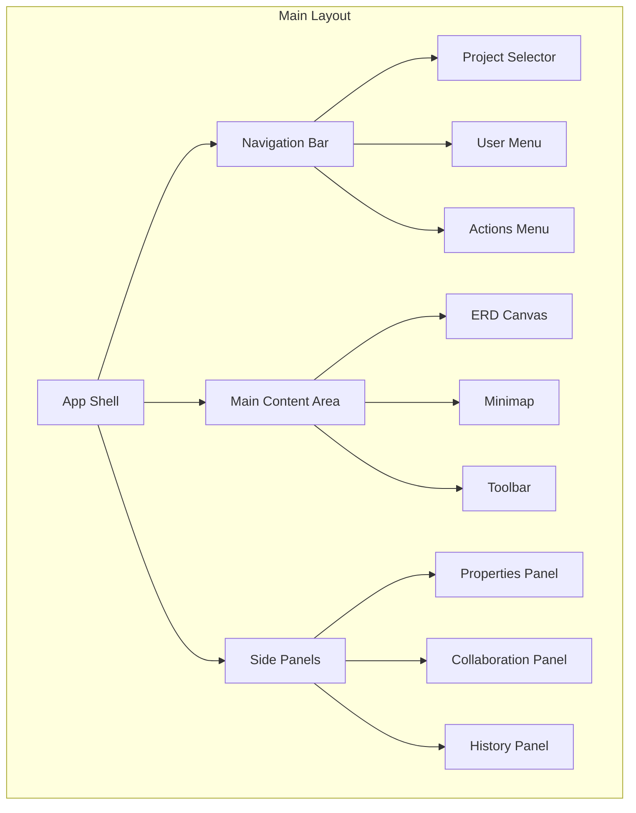

### 3.1.3 Critical User Flows

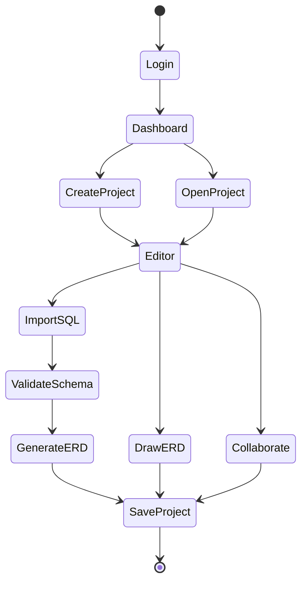

## 3.2 DATABASE DESIGN

### 3.2.1 Schema Design

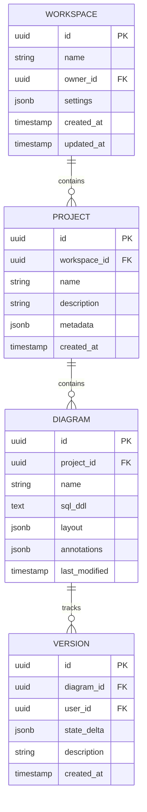

### 3.2.2 Data Management Strategy

| Aspect | Implementation |
| --- | --- |
| Migrations | - Prisma migrations<br>- Version controlled<br>- Rollback support<br>- Data validation |
| Versioning | - Incremental version numbers<br>- State delta storage<br>- Bidirectional version traversal |
| Retention | - Active data: indefinite<br>- Versions: 30 days<br>- Audit logs: 90 days<br>- Soft deletion |
| Privacy | - Data encryption at rest<br>- PII handling<br>- GDPR compliance<br>- Data export/deletion |
| Auditing | - Change tracking<br>- Access logging<br>- Error logging<br>- Performance metrics |

### 3.2.3 Performance Optimization

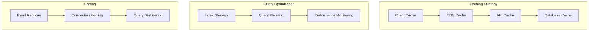

## 3.3 API DESIGN

### 3.3.1 API Architecture

| Component | Specification |
| --- | --- |
| Protocol | REST over HTTPS, WebSocket for real-time |
| Authentication | JWT with refresh tokens |
| Authorization | RBAC with workspace-level permissions |
| Rate Limiting | 100 requests/minute per user |
| Versioning | URI-based (/v1/, /v2/) |
| Documentation | OpenAPI 3.0 specification |

### 3.3.2 API Endpoints

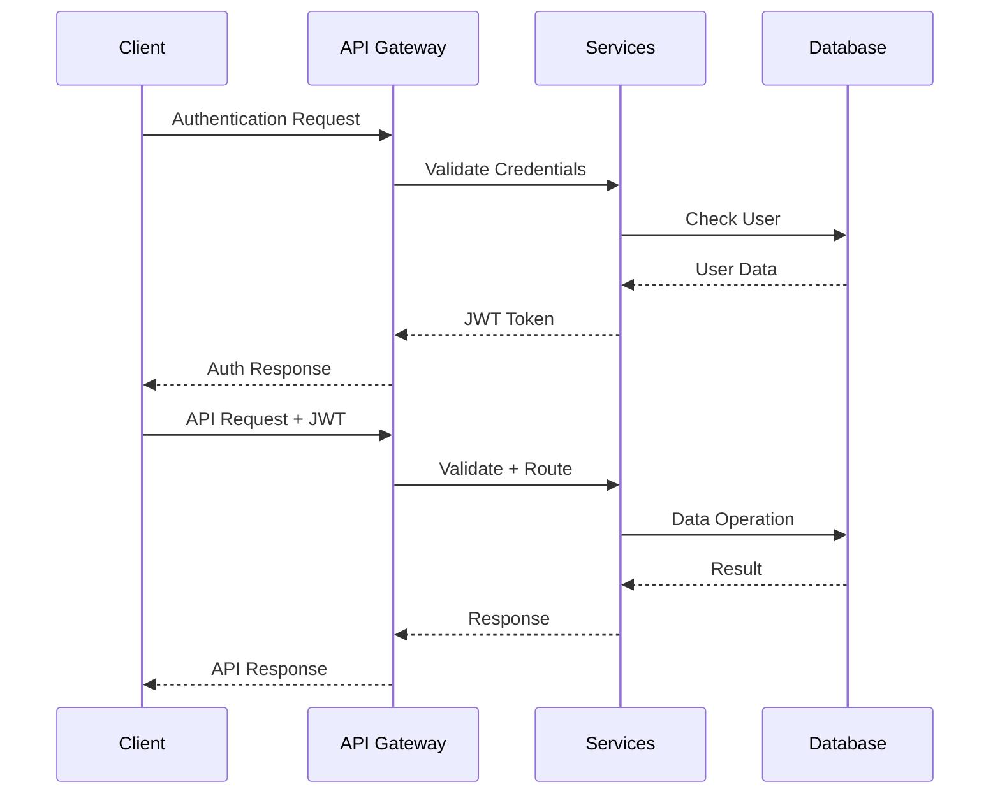

### 3.3.3 WebSocket Protocol

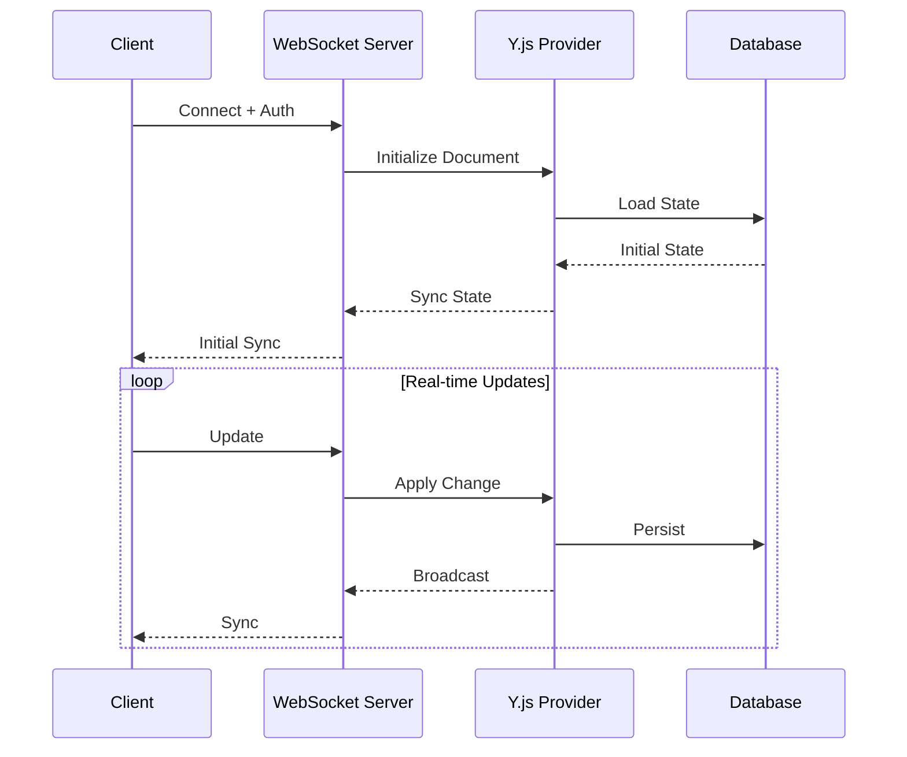

# 4. TECHNOLOGY STACK

## 4.1 PROGRAMMING LANGUAGES

| Platform | Language | Version | Justification |
| --- | --- | --- | --- |
| Frontend | TypeScript | 5.0+ | - Static typing for large-scale application<br>- Enhanced IDE support<br>- Better maintainability |
| Backend | Node.js | 18 LTS | - JavaScript ecosystem compatibility<br>- Event-driven architecture for WebSocket<br>- Rich package ecosystem |
| Build Tools | JavaScript | ES2022 | - Native build tool support<br>- Cross-platform compatibility |

## 4.2 FRAMEWORKS & LIBRARIES

### Core Frameworks

| Component | Framework | Version | Justification |
| --- | --- | --- | --- |
| Frontend UI | React | 18.2+ | - Component-based architecture<br>- Concurrent rendering support<br>- Large ecosystem |
| State Management | Zustand | 4.x | - Lightweight alternative to Redux<br>- Simple integration with React<br>- Built-in TypeScript support |
| UI Components | shadcn/ui | 1.x | - Accessible components<br>- Tailwind CSS integration<br>- Customizable theming |
| Real-time Sync | Y.js | 13.x | - CRDT-based collaboration<br>- Proven scalability<br>- WebSocket integration |
| Diagram Rendering | React Flow | 11.x | - Node-based diagrams<br>- Custom node support<br>- Interactive canvas |

### Supporting Libraries

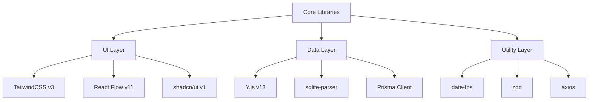

## 4.3 DATABASES & STORAGE

### Primary Storage

| Type | Technology | Version | Purpose |
| --- | --- | --- | --- |
| Relational | SQLite | 3.x | - User data<br>- Project metadata<br>- Version history |
| In-Memory | Redis | 7.x | - Session management<br>- Real-time state<br>- Caching layer |

### Data Flow Architecture

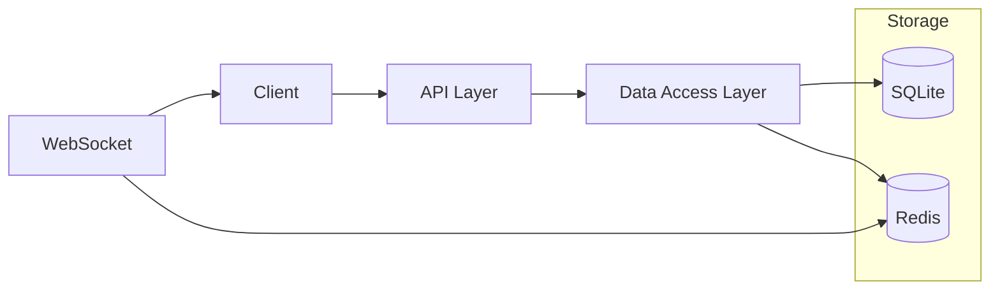

## 4.4 THIRD-PARTY SERVICES

| Service | Provider | Purpose | Integration |
| --- | --- | --- | --- |
| Authentication | Auth.js | User authentication | OAuth/JWT |
| Error Tracking | Sentry | Error monitoring | SDK integration |
| Analytics | Prometheus | Performance metrics | Metrics export |
| CDN | Cloudflare | Static asset delivery | DNS/CNAME |

### Service Dependencies

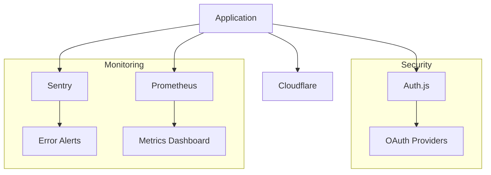

## 4.5 DEVELOPMENT & DEPLOYMENT

### Development Environment

| Tool | Version | Purpose |
| --- | --- | --- |
| Node.js | 18 LTS | Runtime environment |
| pnpm | 8.x | Package management |
| TypeScript | 5.0+ | Development language |
| ESLint | 8.x | Code linting |
| Prettier | 3.x | Code formatting |
| Vitest | 0.34+ | Unit testing |
| Playwright | 1.x | E2E testing |

### Deployment Pipeline

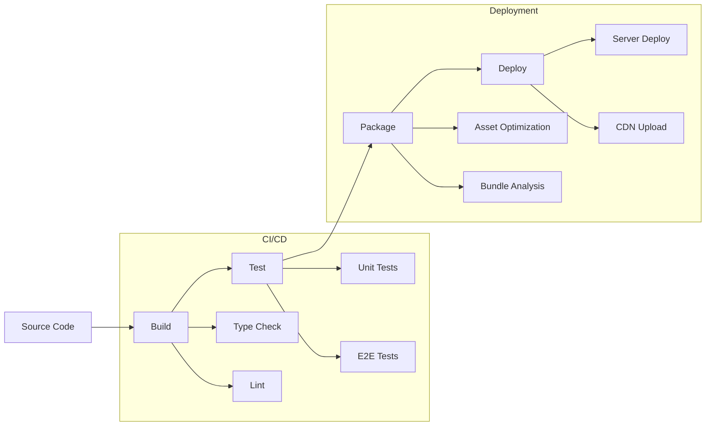

### Build System Requirements

| Phase | Tool | Configuration |
| --- | --- | --- |
| Build | Vite | - TypeScript compilation<br>- Asset optimization<br>- Code splitting |
| Test | Vitest/Playwright | - Unit test coverage \> 80%<br>- E2E test suites<br>- Performance benchmarks |
| Deploy | Docker | - Multi-stage builds<br>- Production optimization<br>- Security scanning |

# 5. SYSTEM DESIGN

## 5.1 USER INTERFACE DESIGN

### 5.1.1 Layout Structure

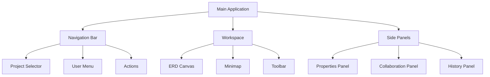

### 5.1.2 Component Specifications

| Component | Features | Interactions |
| --- | --- | --- |
| ERD Canvas | - Zoomable workspace<br>- Grid background<br>- Entity nodes<br>- Relationship edges | - Drag and drop<br>- Multi-select<br>- Context menu<br>- Pan and zoom |
| Properties Panel | - Entity properties<br>- Column definitions<br>- Relationship settings | - Form inputs<br>- Real-time validation<br>- Auto-save |
| Collaboration Panel | - User presence<br>- Chat interface<br>- Change history | - Message input<br>- User selection<br>- History navigation |

### 5.1.3 Responsive Behavior

| Breakpoint | Layout Adjustments |
| --- | --- |
| Desktop (\>1024px) | - Full three-panel layout<br>- Persistent side panels<br>- Expanded toolbar |
| Tablet (768-1024px) | - Collapsible side panels<br>- Compact toolbar<br>- Floating minimap |
| Mobile (\<768px) | - Single panel view<br>- Modal side panels<br>- Hidden minimap |

## 5.2 DATABASE DESIGN

### 5.2.1 Schema Design


### 5.2.2 Data Storage Strategy

| Storage Type | Purpose | Implementation |
| --- | --- | --- |
| Primary Data | User and project data | SQLite with Prisma ORM |
| Real-time State | Collaboration data | Redis with pub/sub |
| File Storage | Exported diagrams | Local filesystem |
| Cache | Frequently accessed data | Redis with LRU policy |

## 5.3 API DESIGN

### 5.3.1 REST API Endpoints

```mermaid
graph LR
    A[API Gateway] --> B[/auth/*]
    A --> C[/workspaces/*]
    A --> D[/projects/*]
    A --> E[/diagrams/*]
    
    B --> B1[POST /login]
    B --> B2[POST /logout]
    
    C --> C1[GET /workspaces]
    C --> C2[POST /workspaces]
    
    D --> D1[GET /projects]
    D --> D2[POST /projects]
    
    E --> E1[GET /diagrams]
    E --> E2[POST /diagrams]
```

### 5.3.2 WebSocket Protocol

| Event Type | Direction | Payload Structure |
| --- | --- | --- |
| sync_state | Bidirectional | `{type: 'sync', data: Y.js update}` |
| cursor_update | Client → Server | `{type: 'cursor', position: {x, y}}` |
| presence | Bidirectional | `{type: 'presence', user: UserData}` |
| chat_message | Bidirectional | `{type: 'chat', message: string}` |

### 5.3.3 Integration Points

```mermaid
sequenceDiagram
    participant Client
    participant API
    participant WebSocket
    participant Database
    participant Redis
    
    Client->>API: Authentication Request
    API->>Database: Validate Credentials
    Database-->>API: User Data
    API-->>Client: JWT Token
    
    Client->>WebSocket: Connect + Auth
    WebSocket->>Redis: Subscribe to Room
    
    loop Real-time Updates
        Client->>WebSocket: Send Update
        WebSocket->>Redis: Publish Update
        Redis-->>WebSocket: Broadcast
        WebSocket-->>Client: Sync State
    end
```

# 6. USER INTERFACE DESIGN

## 6.1 Layout Structure

The application follows a standard layout with fixed navigation and dynamic content areas:

```
+----------------------------------------------------------+
|                     Navigation Bar                         |
| [#]Project [=]View [@]Profile        [?]Help [!]Alerts    |
+----------------------------------------------------------+
|          |                                    |            |
| Project  |           ERD Canvas              | Properties |
| Explorer |                                    |   Panel   |
|          |                                    |            |
| [+]New   |     +----------------+            | Table:     |
| [-]SQL   |     |  Users         |            | [.......] |
| [-]ERD   |     |  id           >|            |           |
|          |     |  email        ||            | Columns:  |
| Projects:|     |  created_at   ||            | [+]Add    |
| +--Proj1 |     +----------------+            | [-]Remove |
| +--Proj2 |            |                      |           |
|          |            |                      | Relations:|
|          |     +----------------+            | [v]Select |
|          |     |  Orders        |            |           |
|          |     |  id           >|            |           |
|          |     |  user_id     <||            |           |
|          |     |  total        ||            |           |
|          |     +----------------+            |           |
|          |                                    |           |
+----------------------------------------------------------+
| [Connected] | Users Online: 3 | Last saved: 2m ago        |
+----------------------------------------------------------+
```

## 6.2 Component Key

```
Navigation Elements:
[#] - Dashboard/Menu icon
[=] - View settings
[@] - User profile
[?] - Help documentation
[!] - Notifications/Alerts

Project Controls:
[+] - Create new item
[-] - Expand/Collapse
[>] - Foreign key (outgoing)
[<] - Foreign key (incoming)
[v] - Dropdown menu

Status Indicators:
[====] - Progress bar
[Connected] - Connection status
```

## 6.3 Modal Dialogs

### SQL Import Dialog

```
+------------------------------------------+
|  Import SQL                           [x] |
+------------------------------------------+
| Database Type: [v] PostgreSQL            |
|                                          |
| SQL Input:                               |
| +----------------------------------+     |
| |CREATE TABLE users (              |     |
| |  id SERIAL PRIMARY KEY,         |     |
| |  email VARCHAR(255) NOT NULL    |     |
| |);                               |     |
| +----------------------------------+     |
|                                          |
| [Validate] [Import] [Cancel]             |
+------------------------------------------+
```

### Collaboration Panel

```
+------------------------------------------+
|  Collaboration                        [x] |
+------------------------------------------+
| Online Users:                            |
| [@]John Doe (editing)                    |
| [@]Jane Smith (viewing)                  |
| [@]Bob Wilson (idle)                     |
|                                          |
| Chat:                                    |
| +----------------------------------+     |
| |John: Updated users table         |     |
| |Jane: Added email validation      |     |
| +----------------------------------+     |
|                                          |
| Message: [............................]  |
| [Send]                                   |
+------------------------------------------+
```

## 6.4 Interactive Elements

### Table Node

```
+------------------+
| Table Name   [*] |
+------------------+
| [v] Columns      |
| + id            >|
| + name          ||
| + email         ||
+------------------+
| [v] Indexes      |
| [v] Constraints  |
+------------------+
```

### Properties Panel

```
+------------------+
| Properties       |
+------------------+
| Name: [.......] |
|                  |
| Type: [v]        |
| ( )Table         |
| ( )View          |
| ( )Function      |
|                  |
| Schema: [.....] |
|                  |
| [Apply] [Reset]  |
+------------------+
```

## 6.5 Responsive Behavior

The interface adapts to different screen sizes:

- Desktop (\>1024px): Full three-panel layout
- Tablet (768-1024px): Collapsible side panels
- Mobile (\<768px): Single panel with modal overlays

## 6.6 Theme Support

The interface supports both light and dark themes using Tailwind CSS classes:

```
Light Theme Colors:
- Background: bg-white
- Text: text-gray-900
- Borders: border-gray-200
- Accent: bg-blue-600

Dark Theme Colors:
- Background: bg-gray-900
- Text: text-gray-100
- Borders: border-gray-700
- Accent: bg-blue-500
```

## 6.7 Accessibility Features

- ARIA labels on all interactive elements
- Keyboard navigation support
- Focus indicators
- Color contrast compliance
- Screen reader optimizations
- Semantic HTML structure

## 6.8 Loading States

```
+------------------+
| Loading...       |
+------------------+
| [====    ] 60%   |
|                  |
| Parsing SQL...   |
+------------------+
```

## 6.9 Error States

```
+------------------+
| Error        [!] |
+------------------+
| Invalid SQL      |
| syntax near      |
| line 15         |
|                  |
| [View] [Dismiss] |
+------------------+
```

# 7. SECURITY CONSIDERATIONS

## 7.1 AUTHENTICATION AND AUTHORIZATION

### Authentication Flow

```mermaid
sequenceDiagram
    participant User
    participant Client
    participant Auth.js
    participant API
    participant Redis
    
    User->>Client: Login Request
    Client->>Auth.js: Authenticate
    Auth.js->>API: Validate Credentials
    API->>Redis: Create Session
    Redis-->>API: Session Token
    API-->>Auth.js: JWT Token
    Auth.js-->>Client: Auth Response
    Client->>User: Redirect to Dashboard
```

### Authorization Matrix

| Role | Workspace Access | Project Actions | Diagram Permissions | Admin Functions |
| --- | --- | --- | --- | --- |
| Owner | Full Access | Create, Edit, Delete | All Permissions | User Management |
| Admin | Full Access | Create, Edit | Edit, Share | Settings Management |
| Editor | View, Edit | Edit Existing | Edit, Comment | None |
| Viewer | View Only | View Only | View, Comment | None |
| Guest | Specific Share | View Shared | View Only | None |

### Session Management

| Component | Implementation | Details |
| --- | --- | --- |
| Token Type | JWT | RS256 signing algorithm |
| Token Lifetime | Access: 1 hour<br>Refresh: 7 days | Sliding expiration |
| Session Store | Redis | 24-hour TTL |
| Rate Limiting | 100 requests/minute | Per-user basis |
| MFA Support | TOTP, Email | Optional per workspace |

## 7.2 DATA SECURITY

### Data Protection Layers

```mermaid
flowchart TD
    A[Client Data] -->|TLS 1.3| B[Transport Layer]
    B -->|Input Validation| C[Application Layer]
    C -->|Access Control| D[Service Layer]
    D -->|Encryption| E[Storage Layer]
    
    subgraph Security Controls
        F[XSS Prevention]
        G[SQL Injection Protection]
        H[CSRF Tokens]
        I[Data Encryption]
    end
```

### Encryption Standards

| Data Type | Encryption Method | Key Management |
| --- | --- | --- |
| User Credentials | Argon2id | Salt + Pepper |
| Session Data | AES-256-GCM | Rotating Keys |
| Database | AES-256-CBC | HSM Integration |
| API Tokens | HMAC-SHA256 | Secure Key Store |
| File Storage | AES-256-CTR | Per-File Keys |

### Data Classification

| Category | Examples | Protection Level |
| --- | --- | --- |
| Critical | User credentials, API keys | Encryption + Access Logs |
| Sensitive | SQL schemas, ERD data | Encryption + RBAC |
| Internal | Comments, annotations | RBAC |
| Public | Public documentation | None |

## 7.3 SECURITY PROTOCOLS

### Security Implementation

```mermaid
flowchart LR
    A[Security Layers] --> B[Prevention]
    A --> C[Detection]
    A --> D[Response]
    
    B --> B1[Input Validation]
    B --> B2[Access Control]
    B --> B3[Encryption]
    
    C --> C1[Audit Logging]
    C --> C2[Monitoring]
    C --> C3[Alerts]
    
    D --> D1[Incident Response]
    D --> D2[Backup Recovery]
    D --> D3[Security Patches]
```

### Security Headers

| Header | Value | Purpose |
| --- | --- | --- |
| Content-Security-Policy | strict-dynamic | XSS Protection |
| X-Frame-Options | DENY | Clickjacking Prevention |
| X-Content-Type-Options | nosniff | MIME Type Protection |
| Strict-Transport-Security | max-age=31536000 | Force HTTPS |
| X-XSS-Protection | 1; mode=block | Browser XSS Filter |

### Security Monitoring

| Component | Monitoring Type | Alert Threshold |
| --- | --- | --- |
| Authentication | Failed attempts | 5 failures/minute |
| API Endpoints | Request rate | 100 requests/minute |
| Database | Access patterns | Unusual query patterns |
| File Access | Download rate | 50 downloads/hour |
| User Sessions | Concurrent logins | 3 simultaneous sessions |

### Compliance Requirements

| Standard | Implementation | Validation |
| --- | --- | --- |
| GDPR | Data encryption, Right to erasure | Annual audit |
| SOC 2 | Access controls, Audit logs | Quarterly review |
| OWASP Top 10 | Security controls | Monthly scanning |
| PCI DSS | Secure transmission | Quarterly assessment |

# 8. INFRASTRUCTURE

## 8.1 DEPLOYMENT ENVIRONMENT

The system is designed for on-premises deployment with optional cloud hosting capabilities.

| Environment Type | Requirements | Purpose |
| --- | --- | --- |
| Development | - Node.js 18 LTS<br>- Redis 7.x<br>- SQLite 3.x<br>- 4GB RAM minimum | Local development and testing |
| Staging | - Linux (Ubuntu 22.04 LTS)<br>- 8GB RAM<br>- 4 vCPUs<br>- 100GB SSD | Pre-production validation |
| Production | - Linux (Ubuntu 22.04 LTS)<br>- 16GB RAM<br>- 8 vCPUs<br>- 250GB SSD | Production deployment |

### Network Architecture

```mermaid
flowchart TD
    A[Load Balancer] --> B[Application Server 1]
    A --> C[Application Server 2]
    
    B --> D[(Redis Primary)]
    C --> D
    
    B --> E[(SQLite + Replication)]
    C --> E
    
    F[CDN] --> A
    
    subgraph Security
        G[WAF]
        H[DDoS Protection]
    end
    
    G --> A
    H --> G
```

## 8.2 CLOUD SERVICES

Optional cloud service providers for enhanced scalability and availability:

| Service Type | Provider | Purpose | Alternative |
| --- | --- | --- | --- |
| CDN | Cloudflare | Static asset delivery | AWS CloudFront |
| Object Storage | AWS S3 | Diagram exports, backups | MinIO (self-hosted) |
| Monitoring | DataDog | System monitoring | Prometheus + Grafana |
| Error Tracking | Sentry | Error reporting | Self-hosted Sentry |

## 8.3 CONTAINERIZATION

Docker-based containerization strategy for consistent deployments:

```mermaid
graph TD
    subgraph Docker Containers
        A[Frontend Nginx]
        B[Node.js API]
        C[WebSocket Server]
        D[Redis]
        E[SQLite + Litestream]
    end
    
    subgraph Volumes
        F[SQLite Data]
        G[Redis Data]
        H[Logs]
    end
    
    A --> B
    A --> C
    B --> D
    C --> D
    B --> E
    C --> E
    
    E --> F
    D --> G
    B & C --> H
```

### Container Specifications

| Container | Base Image | Exposed Ports | Resource Limits |
| --- | --- | --- | --- |
| Frontend | nginx:alpine | 80, 443 | CPU: 0.5, RAM: 512MB |
| API Server | node:18-alpine | 3000 | CPU: 1.0, RAM: 1GB |
| WebSocket | node:18-alpine | 3001 | CPU: 1.0, RAM: 1GB |
| Redis | redis:7-alpine | 6379 | CPU: 0.5, RAM: 1GB |
| SQLite | alpine:3.18 | N/A | CPU: 0.5, RAM: 512MB |

## 8.4 ORCHESTRATION

Simple Docker Compose orchestration for single-server deployments:

```mermaid
graph LR
    subgraph Docker Compose
        A[Traefik] --> B[Frontend]
        A --> C[API]
        A --> D[WebSocket]
        
        C & D --> E[Redis]
        C & D --> F[SQLite]
    end
    
    subgraph Monitoring
        G[Prometheus]
        H[Grafana]
        I[Loki]
    end
    
    C & D --> G
    G --> H
    C & D --> I
```

### Service Configuration

| Service | Replicas | Auto-scaling Rules | Health Checks |
| --- | --- | --- | --- |
| Frontend | 2 | CPU \> 80% | HTTP/80 /health |
| API | 2-4 | CPU \> 75% | HTTP/3000 /health |
| WebSocket | 2-4 | Connections \> 1000 | TCP/3001 |
| Redis | 1 + Sentinel | N/A | Redis PING |
| SQLite | 1 + Replica | N/A | File check |

## 8.5 CI/CD PIPELINE

```mermaid
flowchart LR
    A[Git Push] --> B[GitHub Actions]
    
    subgraph CI
        B --> C[Install Dependencies]
        C --> D[Type Check]
        D --> E[Lint]
        E --> F[Test]
        F --> G[Build]
        G --> H[Docker Build]
    end
    
    subgraph CD
        H --> I[Push Images]
        I --> J[Deploy Staging]
        J --> K[Integration Tests]
        K --> L[Deploy Production]
    end
    
    L --> M[Health Checks]
    M --> N[Monitoring]
```

### Pipeline Stages

| Stage | Actions | Success Criteria |
| --- | --- | --- |
| Build | - Install dependencies<br>- Type checking<br>- Linting<br>- Unit tests<br>- Build artifacts | All checks pass |
| Test | - Integration tests<br>- E2E tests<br>- Security scans<br>- Performance tests | 100% test pass |
| Deploy | - Docker build<br>- Image push<br>- Deploy staging<br>- Smoke tests<br>- Deploy production | Successful deployment |
| Monitor | - Health checks<br>- Performance metrics<br>- Error tracking<br>- Usage analytics | System stability |

# APPENDICES

## A.1 ADDITIONAL TECHNICAL INFORMATION

### A.1.1 Browser Support Matrix

| Browser | Minimum Version | Notes |
| --- | --- | --- |
| Chrome | 90+ | Full feature support |
| Firefox | 88+ | Full feature support |
| Safari | 14+ | Limited cursor tracking |
| Edge | 90+ | Full feature support |
| Opera | 76+ | Full feature support |

### A.1.2 Performance Benchmarks

| Operation | Target Time | Maximum Load |
| --- | --- | --- |
| SQL Parse (100 tables) | \< 1s | 500KB DDL |
| Canvas Render (100 nodes) | \< 2s | 200 edges |
| State Sync | \< 100ms | 50KB delta |
| Export (PNG) | \< 3s | 4K resolution |
| History Load | \< 500ms | 100 versions |

### A.1.3 Data Flow Architecture

```mermaid
flowchart TD
    A[Client] -->|SQL DDL| B[Parser]
    B -->|AST| C[ERD Generator]
    C -->|Graph Data| D[React Flow]
    D -->|Canvas State| E[Y.js Doc]
    E -->|Updates| F[WebSocket]
    F -->|Broadcast| G[Other Clients]
    
    subgraph Storage
        H[(SQLite)]
        I[(Redis)]
    end
    
    E -->|Persist| H
    E -->|Cache| I
```

## A.2 GLOSSARY

| Term | Definition |
| --- | --- |
| Abstract Syntax Tree (AST) | Internal representation of parsed SQL structure |
| Cardinality | Numerical relationship between database entities (one-to-one, one-to-many, etc.) |
| Content Security Policy | Security layer preventing XSS attacks and other injections |
| Delta Updates | Incremental changes to document state for efficient synchronization |
| Entity Node | Visual representation of a database table in the ERD |
| Foreign Key | Column referencing primary key in another table |
| Primary Key | Unique identifier column for database table records |
| Relationship Edge | Visual connection between related entities in ERD |
| Schema | Structural definition of a database including tables and relationships |
| State Persistence | Storage of document changes for recovery and history |
| Workspace | Container for related projects and diagrams |
| Y.doc | Shared document type in Y.js for collaborative editing |

## A.3 ACRONYMS

| Acronym | Full Form |
| --- | --- |
| API | Application Programming Interface |
| AST | Abstract Syntax Tree |
| CRDT | Conflict-free Replicated Data Type |
| CSP | Content Security Policy |
| DDL | Data Definition Language |
| DML | Data Manipulation Language |
| ERD | Entity Relationship Diagram |
| FK | Foreign Key |
| GDPR | General Data Protection Regulation |
| JWT | JSON Web Token |
| ORM | Object-Relational Mapping |
| PK | Primary Key |
| RBAC | Role-Based Access Control |
| REST | Representational State Transfer |
| SDK | Software Development Kit |
| SQL | Structured Query Language |
| SSL | Secure Sockets Layer |
| TLS | Transport Layer Security |
| UI | User Interface |
| UUID | Universally Unique Identifier |
| WSS | WebSocket Secure |
| XSS | Cross-Site Scripting |
| YAML | YAML Ain't Markup Language |

## A.4 REFERENCE ARCHITECTURE

```mermaid
C4Context
    title Reference Architecture - ERD Tool Components

    Container(client, "Web Client", "React, TypeScript", "Browser application")
    Container(api, "API Server", "Node.js, Express", "Backend services")
    Container(ws, "WebSocket Server", "Y.js", "Real-time sync")
    ContainerDb(db, "Database", "SQLite", "Data persistence")
    ContainerDb(cache, "Cache", "Redis", "Session and state")
    
    Rel(client, api, "REST API", "HTTPS")
    Rel(client, ws, "Real-time", "WSS")
    Rel(api, db, "Queries", "SQL")
    Rel(ws, cache, "State", "Redis Protocol")
    Rel(api, cache, "Session", "Redis Protocol")
```

## A.5 SUPPORTED SQL DIALECTS

| Dialect | Version | Feature Support |
| --- | --- | --- |
| PostgreSQL | 12+ | Full DDL support |
| Snowflake | Current | Tables and relationships |
| MySQL | 8+ | Planned for future |
| SQLite | 3+ | Basic table support |
| SQL Server | 2019+ | Planned for future |
| Oracle | 19c+ | Planned for future |